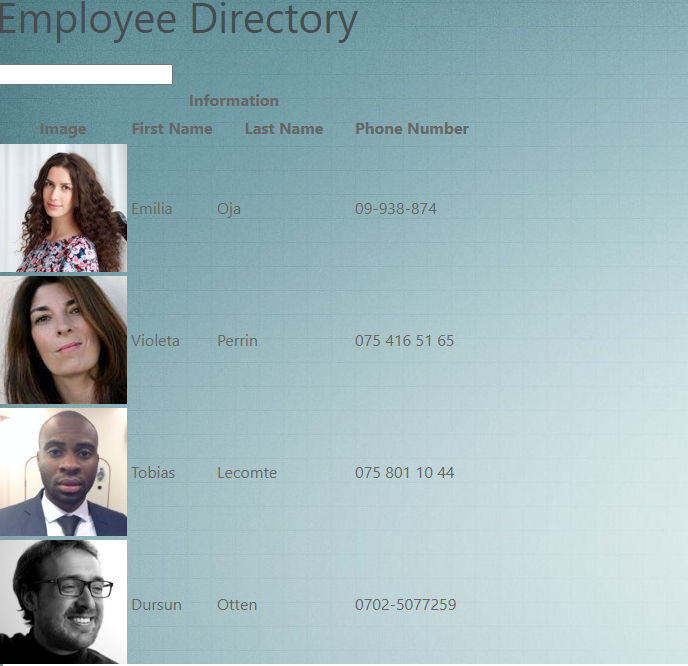

# Employee-Directory
This app is designed to allow the user to view a list of their employees' names, numbers, emails ect.

# Run
npm start

Open [http://localhost:3000](http://localhost:3000) to view it in the browser.

The page will refresh itself if you make edits. 

